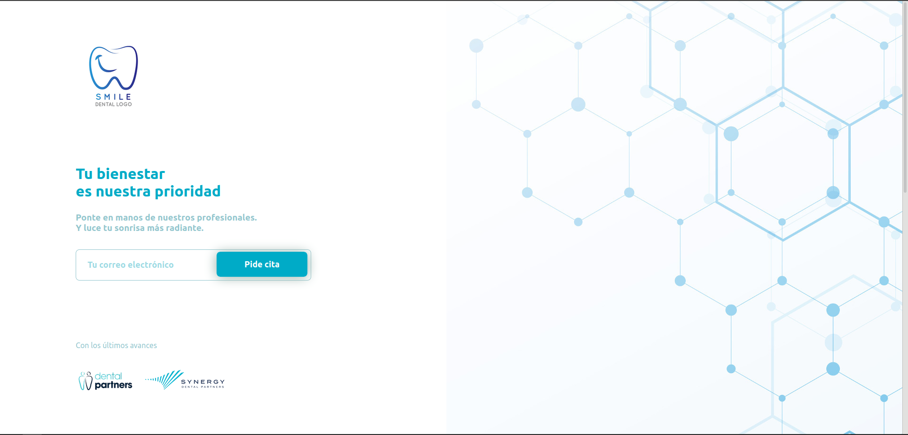
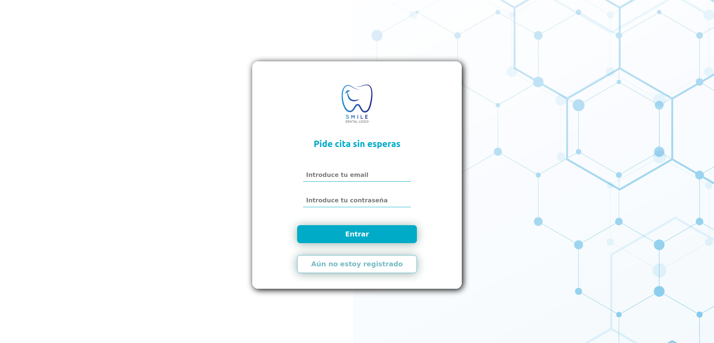
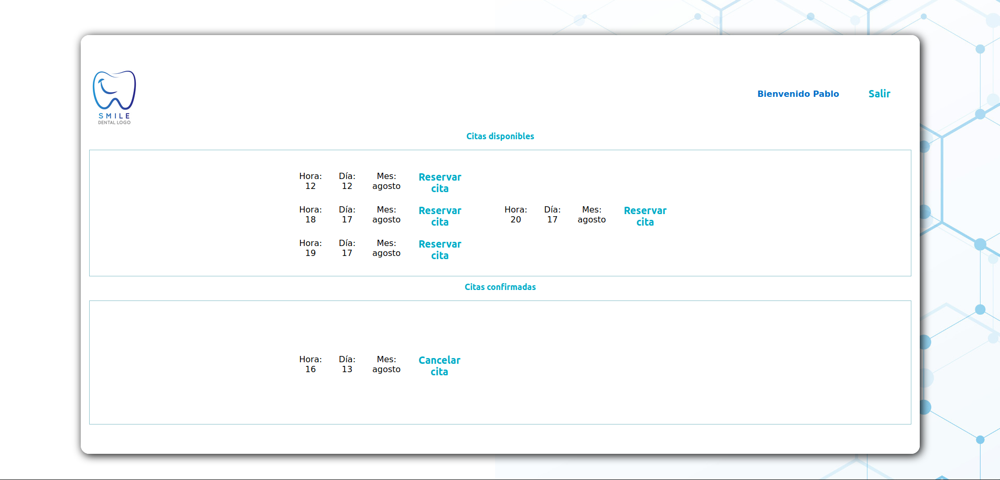

# Dental App
An application for making appointments in a dental clinic.
<br>
<br>

## 1. Technologies
This is a project to learn how to work with:
* React, 
* Redux, 
* PHP and 
* Laravel. 

Please feel free to explore my code. I welcome any suggestion or comment to improve it.
<br>
<br>
Here you can find some screenshots of the app running:

 
 
 

<br>
<br>

## 2. Installation
This repository contains the frontend (dentalapp) and the backend (dentalappbackend) folders.

First of all, open a terminal and clone the repository in the desired directory:
```
$ git clone https://github.com/Adrian-M-A/DentalAppointment
```
Second, enter the dentalapp folder and install all the dependencies:
```
$ cd dentalapp
$ npm i
```
<br>
With the frontend ready, now let's prepare the backend.
<br>
<br>
First, enter the dentalappbackend folder and install all the dependencies:

```
$ cd ..
$ cd dentalappbackend
$ composer update
```

Second, rename .env.example file as .env

Third, create a DB called Laravel in MSQL.

Fourth, require laravel passport:
```
$ composer require laravel/passport
``` 

Fifth, migrate all the tables:
```
$ php artisan migrate
```

Sixth, install passport:
```
$ php artisan passport:install
```

If you want to see some posible appointments you should fill your timepicker table with some information about the appointment (hour, day, month, year, etc.).
<br>
<br>

## 3. Management
To run the application be sure to get running a MYSQL server (like XAMPP), and then:

Inside the dentalappbackend folder, run:
```
$ php artisan serve
```

In another terminal, enter inside the dentalapp folder and run:
```
npm start
```

A window will pop up in your navigator and you will have direct access to the app.

<br>

## 4. Copyright and license

Under GNU-GPL3 license. For more information check out the 
LICENSE file.

<br>

## 5. Contact information and credits

Author: Adrián M.A.

Contact: adrian@neurocadi.es 
  
<br>


